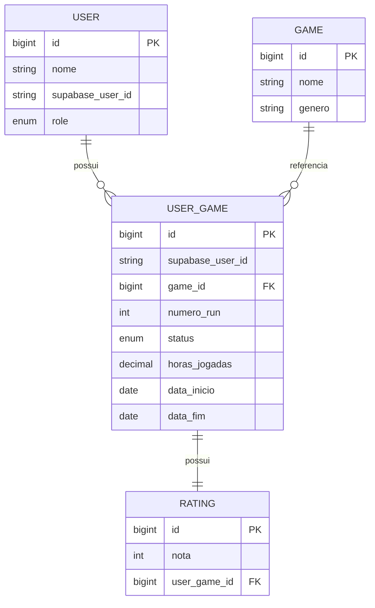

# Projeto-Back-End-Api-de-Jogos

Sistema backend para gerenciamento de jogos, acompanhamento de múltiplas runs, avaliações, autenticação JWT via Supabase e controle de acesso baseado em roles.

---

## Sumário

- [Equipe do Projeto](#equipe-do-projeto)
- [Visão Geral](#visao-geral)
- [Arquitetura da Aplicação](#arquitetura-da-aplicacao)
- [Tecnologias Utilizadas](#tecnologias-utilizadas)
- [Segurança e Autenticação](#seguranca-e-autenticacao)
- [Controle de Acesso (Roles)](#controle-de-acesso-roles)
- [Isolamento de Dados](#isolamento-de-dados)
- [Regras de Negócio](#regras-de-negocio)
- [Modelagem do Banco](#modelagem-do-banco)
- [Endpoints](#endpoints)
- [Tratamento Global de Exceções](#tratamento-global-de-excecoes)
- [Swagger](#swagger)
- [Como Executar Localmente](#como-executar-localmente)

---

## Equipe do Projeto

| Integrante | Matrícula |
|------------|------------|
| Ricardo Azevedo | 01834551 |
| Francileidy Conceição | 01837744 |
| Anna Beatriz | 01849891 |
| Grazielle Diniz | 01831671 |
| Adrielly Kauany | 01835056 |

---

## Visão Geral

A API foi desenvolvida para registrar jogos e acompanhar a experiência individual dos usuários ao longo do tempo.

O sistema permite:

- catálogo global de jogos
- múltiplas runs para um mesmo jogo
- acompanhamento de progresso
- controle de horas jogadas
- avaliações
- autenticação via JWT
- autorização baseada em papéis (USER e ADMIN)

O foco principal da aplicação é garantir integridade dos dados, isolamento entre usuários e aplicação consistente das regras de negócio.

---

## Arquitetura da Aplicação

A aplicação segue arquitetura em camadas:

```text
Controller
↓
Service
↓
Repository
↓
Banco de Dados
```

### Controllers

Responsáveis por receber requisições HTTP e retornar respostas REST.

### Services

Centralizam toda a lógica de negócio do sistema.

### Repositories

Realizam acesso ao banco utilizando Spring Data JPA.

### DTOs

Controlam os dados enviados e recebidos pela API.

### Security

Responsável pela autenticação JWT e autorização baseada em roles.

### Exception Handler

Centraliza e padroniza os erros retornados pela API.

---

## Tecnologias Utilizadas

- Java 21
- Spring Boot 3
- Spring Security
- OAuth2 Resource Server
- JWT
- Supabase Auth
- Spring Data JPA
- Hibernate
- MySQL / MariaDB
- Swagger OpenAPI
- Lombok
- Maven

---

## Segurança e Autenticação

A autenticação é realizada através de JWT emitido pelo Supabase.

Fluxo:

```text
Usuário
↓
Supabase Auth
↓
JWT
↓
Spring Security
↓
API
```

Todos os endpoints protegidos exigem:

```http
Authorization: Bearer <token>
```

Quando o token estiver ausente, inválido ou expirado:

```http
401 Unauthorized
```

---

## Controle de Acesso (Roles)

### USER

Permissões:

- gerenciar próprio perfil
- criar runs
- editar runs
- remover runs
- criar avaliações
- editar avaliações
- buscar usuários por nome

### ADMIN

Possui todas as permissões de USER e também:

- criar jogos
- editar jogos
- remover jogos
- listar usuários
- alterar roles

### Regra Especial

Um administrador não pode remover sua própria role ADMIN.

---

## Isolamento de Dados

O sistema utiliza o identificador único fornecido pelo Supabase:

```text
supabaseUserId
```

Toda operação relacionada a:

- UserGame
- Rating

é automaticamente filtrada pelo usuário autenticado.

Isso impede acesso a dados de terceiros.

---

## Regras de Negócio

### Usuários

#### Criação Automática

No primeiro acesso autenticado:

- usuário é criado automaticamente
- role inicial é USER
- supabaseUserId é armazenado

#### Perfil

O usuário pode alterar apenas seu próprio nome.

#### Busca por Nome

Usuários autenticados podem buscar outros usuários.

O retorno utiliza UserPublicDto:

```json
{
  "id": 1,
  "nome": "Ricardo"
}
```

Sem exposição de:

- role
- supabaseUserId

---

### Games

#### Regras

- nome obrigatório
- gênero opcional
- leitura pública
- criação, edição e remoção apenas por ADMIN

---

### UserGame (Run)

Representa uma tentativa concreta de jogar um jogo.

Campos:

- numeroRun
- status
- horasJogadas
- dataInicio
- dataFim

---

### numeroRun

Primeira run:

```text
numeroRun = 1
```

Nova tentativa:

```text
numeroRun = última run + 1
```

Runs antigas nunca são sobrescritas.

---

### Status

- BACKLOG
- JOGANDO
- FINALIZADO
- DROPADO

---

### Regras por Status

#### BACKLOG

- sem datas
- sem horas

#### JOGANDO

- dataInicio obrigatória
- dataFim proibida

#### FINALIZADO

- dataInicio obrigatória
- dataFim obrigatória
- horas > 0
- horas tornam-se imutáveis

#### DROPADO

- permite retorno para JOGANDO

---

### Transições Permitidas

```text
BACKLOG -> JOGANDO

JOGANDO -> FINALIZADO
JOGANDO -> DROPADO

DROPADO -> JOGANDO
```

Não permitido:

```text
FINALIZADO -> qualquer outro status
```

---

### Consistência

- apenas uma run JOGANDO por jogo
- dataFim não pode ser anterior à dataInicio
- horas não podem ser negativas

---

### Rating

Regras:

- nota entre 0 e 10
- apenas para jogos FINALIZADOS
- apenas uma avaliação por run

---

## Modelagem do Banco



---

## Endpoints

### Games

| Método | Endpoint | Acesso |
|----------|----------|----------|
| GET | /games | Público |
| GET | /games/buscar-id/{id} | Público |
| GET | /games/buscar-nome/{nome} | Público |
| POST | /games | ADMIN |
| PUT | /games/{id} | ADMIN |
| DELETE | /games/{id} | ADMIN |

### Users

| Método | Endpoint | Acesso |
|----------|----------|----------|
| GET | /users/me | Autenticado |
| PUT | /users/me | Autenticado |
| DELETE | /users/me | Autenticado |
| GET | /users | ADMIN |
| GET | /users/buscar-nome/{nome} | Autenticado |
| PATCH | /users/{id}/role | ADMIN |

### User Games

| Método | Endpoint |
|----------|----------|
| POST | /user-games |
| GET | /user-games |
| GET | /user-games/buscar-id/{id} |
| PUT | /user-games/{id} |
| DELETE | /user-games/{id} |

### Ratings

| Método | Endpoint |
|----------|----------|
| POST | /rating |
| GET | /rating |
| GET | /rating/{id} |
| PUT | /rating/{id} |
| DELETE | /rating/{id} |

---

## Tratamento Global de Exceções

| Exceção | HTTP |
|----------|----------|
| UserNotFoundException | 404 |
| GameNotFoundException | 404 |
| AccessDeniedException | 403 |
| InvalidUserDataException | 400 |
| RunEmAndamentoException | 409 |
| RatingException | 409 |
| StatusException | 409 |
| DatasException | 409 |
| HorasException | 409 |

Formato padrão:

```json
{
  "status": 409,
  "mensagem": "Descrição do erro"
}
```

---

## Swagger

Após iniciar a aplicação:

```text
http://localhost:35555/swagger-ui/index.html
```

Para acessar endpoints protegidos:

1. Obtenha um JWT válido no Supabase.
2. Clique em Authorize.
3. Informe:

```text
Bearer <token>
```

4. Execute os endpoints normalmente.

---

## Como Executar Localmente

### Pré-requisitos

- OpenJDK 21
- Maven 3.9+
- MySQL 8 ou MariaDB

### Banco

```sql
CREATE DATABASE apiJogosBD;
```

### Configuração

Arquivo:

```text
src/main/resources/application.properties
```

Configure:

```properties
spring.datasource.username=usuario
spring.datasource.password=senha
```

### Executar

```bash
mvn spring-boot:run
```
